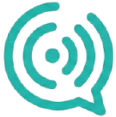
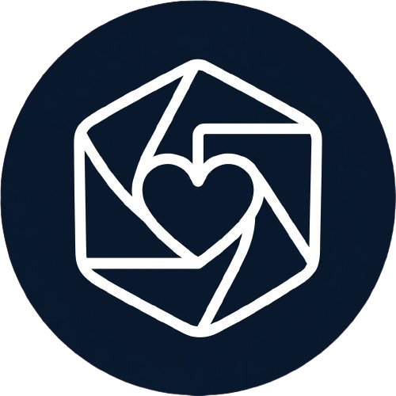

# oi, eu sou o pandassauro

$\color{#FF6B35}{\textsf{\Large ceo, dj e comediante.}}$

### $\color{#FF6B35}{\textsf{construindo agora}}$

<table>
  <tr>
    <td width="160" align="center"></td>
    <td><b>echo</b> — stack de mensageria via whatsapp pra hospitalidade. multi-instância, painel pra equipe e o encanamento que faz tudo conversar com o resto do negócio.</td>
  </tr>
  <tr>
    <td width="160" align="center"></td>
    <td><b>memora</b> — biblioteca de fotos auto-hospedada com álbuns por exif, visualização em mapa, reconhecimento facial on-device. roda 100% em docker. sem dependência de saas. <i>suas fotos, sua máquina.</i> <a href="https://github.com/PaNdassauro/Memora-OpenSource">(versão open source)</a></td>
  </tr>
</table>

### $\color{#4A90E2}{\textsf{stack}}$

### $\color{#B084CC}{\textsf{side quests}}$

- **poseit** — câmera que sugere pose com silhueta sobreposta

### $\color{#FF6B35}{\textsf{me achar por aqui}}$

**email** — `dhgabardo@gmail.com`

---

> "INFLAMAAA, BORA"

<i>𝓵𝓪 𝓳𝓸𝔂 𝓼𝓸𝓬𝓲𝓪𝓵 𝓬𝓵𝓾𝓫</i>

